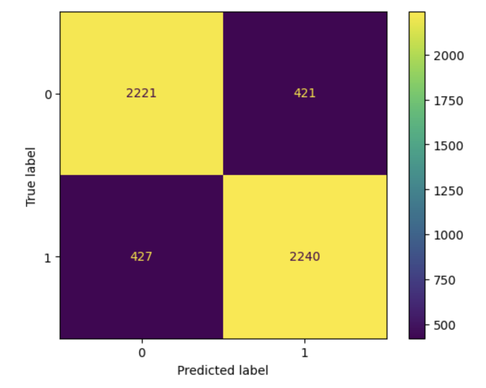

# The-Carry

by Andy Truong (amt007@ucsd.edu)

## Introduction

A DSC80 Exploratory Data Anaylsis Project on which League of Legends (LoL) position/role "carries" the hardest, the Attack Damage Carry (Bot), commonly refered to as the ADC, or the Mid Laner (Mid), as well as a winner predictor model.

---

It has long been a debated topic within the community about which role in the game is the most impactful between the Mid Laner and the ADC. The Mid Laner being the spearhead of the team, as the player controls the shortest path to the enemy's nexus. Whereas the ADC is the main damage source for their team to pick off enemy players and guide their team to success.

Although both roles are essential to winning, we want to know which role in particular between the two "carries", performs exceptionally well in matches and the most effective on the team, the hardest.

The data set which we will use is from Oracle's Elixir, which provides CSV files of data on League of Legend Competitive Matches from 2014 to 2023. However, for our project, we will be focusing on 2022, since it is the most recent completed data set. There are groups of 12 rows which contain one match summary in the data set: 10 rows which represents the number of players on both teams, and 2 more rows that contain the team's summary data.

The data set has 149232 rows, and 123 columns. However, we will be focusing on these columns which will help answer our question: position, datacompleteness, result, playername, kills, assists, deaths, totalgold, damagetochampions, doublekills, triplekills,quadrakills, and pentakills.

- position : position/role for each team, which contains 'top','jng' (jungle),'mid' (middle),'bot' (bottom or adc), and 'sup' (support) (str).
- datacompleteness : whether a game has missing data, contains 'complete' and 'partial' as values (str).
- result: indicates whether that player/team won the match (1 is True, 0 is False) (int)
- playername: name of the player on the team (str).
- kills: total number of kills for that player (int).
- assists: total number of assists for that player (int).
- deaths: total number of deaths for that player (int).
- totalgold: total gold accumalted in the game for that player (int).
- damagetochampions: total damage to champions by the player (int).
- doublekills: number of double kills made by the player (int).
- triplekills: number of triple kills made by the player (int).
- quadrakills: number of quadra kills made by the player (int).
- pentakills: number of penta kills made by the player (int).

## Cleaning and EDA

Since we are focused on the position played by each player, we do not need the rows which contain the team's summary data. Therefore, we keep the rows where the playername column is not null, since the team rows have null values in the playername column.

After that, we want to convert the result column to a series of boolean values which indicate whether a team has won or lost.
Thus, we apply a lambda function which converts those 1 and 0s to Trues and Falses.

To create another metric to determine which role performs the best, we will use a point system, that is found in the League of Legends Wikia, called "Dominance Factor" that is used to determine how dominant the player was in the game.

**Equation: Dominance Factor = 2 x Kills + Assists - 3 x Deaths**

Unsurprisingly, the data set does contain empty values. Therefore, we must fill those null values with np.NaNs, specifically within the columns that contain the multi kills.

Furthermore, we want to be able to get the amount of multi kills each player got in a game. So we will add up the count of double, triple, quadra, and penta kills and assign a new column to that dataframe called 'multikills'

We will also drop playername column since we do not need to know the names of each player.

Additionally, since we are only focused on the mid and bot lane, we will only look at the rows of mid and bot positions.

Here is the head of our cleaned dataframe:

| datacompleteness | result | position | kills | assists | deaths | totalgold | damagetochampions | doublekills | triplekills | quadrakills | pentakills | dominance_factor | multikills |
| :--------------- | :----- | :------- | ----: | ------: | -----: | --------: | ----------------: | ----------: | ----------: | ----------: | ---------: | ---------------: | ---------: |
| complete         | False  | mid      |     2 |       3 |      2 |      9715 |             14258 |           0 |           0 |           0 |          0 |                1 |          0 |
| complete         | False  | bot      |     2 |       2 |      4 |     10605 |             11106 |           0 |           0 |           0 |          0 |               -6 |          0 |
| complete         | True   | mid      |     6 |      12 |      3 |     11532 |             20690 |           2 |           0 |           0 |          0 |               15 |          2 |
| complete         | True   | bot      |     8 |      10 |      2 |     14018 |             26687 |           3 |           0 |           0 |          0 |               20 |          3 |
| complete         | False  | mid      |     2 |       0 |      4 |     15149 |             23082 |           0 |           0 |           0 |          0 |               -8 |          0 |

## Univariate Analysis

<iframe src="assets/dominance_factor_bar.html" width=800 height=600 frameBorder=0></iframe>

In this bar graph, we can see that the Bot has a higher Dominance Factor average than Mid within the data set.

<iframe src="assets/file-name.html" width=800 height=600 frameBorder=0></iframe>

In this bar graph, we can see that the Bot has a higher average kill count than Mid within the data set.

<iframe src="assets/averagedamage.html" width=800 height=600 frameBorder=0></iframe>

In this bar graph, we can see that Bot has a slightly higher average damage to champions than Mid within the data set

<iframe src="assets/multikillbarfixed.html" width=800 height=600 frameBorder=0></iframe>

In this bar graph, we can see that Bot has a higher multi kill average than Mid within the data set

## Bivariate Analysis

<iframe src="assets/multikillbifix.html" width=800 height=600 frameBorder=0></iframe>

In this graph, we can see that when the game is won or lost, Bot still maintains a higher multi kill average than Mid.

<iframe src="assets/damagetochampsbivariatefix.html" width=800 height=600 frameBorder=0></iframe>

In this graph, we can see that when the game is won or lost, bot maintains has a slightly higher damage average onto champions than mid.

<iframe src="assets/killsavgsbivariatefix.html" width=800 height=600 frameBorder=0></iframe>

In this graph, we can see that when the game is won or lost, bot maintains a higher kill average than mid.

## Interesting Aggregates

This is a pivot table where the index is the position, the results are the columns, and the values are the dominance factor, aggregated to be the average.

| position |    False |    True |
| :------- | -------: | ------: |
| bot      | -1.98939 | 14.4797 |
| mid      | -2.70872 |  12.554 |

As we can see here, whenever bot or mid lose, they have a negative dominance factor. However, bot still manages to have a higher dominance factor in both results.

# Assessment of Missingness

## NMAR Analysis

A column where we believe could be argued as NMAR, where the missingness depends on the values themselves, is the doublekill column. Since there is a chance that games are not as "intense" with multiple killing sprees as enemies could be picked off one by one, it is reasonable that games could not have double kills since there could be moments where it isn't possible or the game is simply won through objectives. Or simply there could be no carry on the team that eliminates a lot of enemies at once.

## Missingness Dependency

We will run a permutation test to determine if the damagetochampions column is MAR vs MCAR, with the column datacompleteness. We will compare the distribution of data completeness when damagetochampions is missing vs not missing.

We chose our test statistic to be be Total Variation Distance, since we are looking at two categorical distributions, complete vs partially complete in the data completeness column. We will also use a significance level of 0.05

<iframe src="assets/fixedempirical.html" width=800 height=600 frameBorder=0></iframe>

After running our permutation test by shuffling the missing damagetochampion columns, we found that our p value is 0.012, which is less than the signifcance level. Thus, we reject the null hypothesis that the damagetochampion column does not depend on the data completeness column, and is potentially to be MAR dependent on datacompletness.

We also will run a permutation test to determine if multi kills is MAR vs MCAR with the column position.

In similar fashion, we choose TVD as our test statistic and a significance level of 0.05.

<iframe src="assets/empiricaldistofmultikills.html" width=800 height=600 frameBorder=0></iframe>

After running our permutation test, we get a p value of 1, which suggests that we strongly fail to the null hypothesis that the distribution of positions is the same when multi kills is missing or not missing. This means that that the multkills column could potentailly be MCAR.

# Hypothesis Testing

Now to finally answer our question, which position carries the hardest, bot or mid? To determine this, we will run a permutation test.

To measure "carrying," we will use the column 'damagetochampions'. Although initially we were going to use dominance factor, we found out that players could have a relatively high dominance factor but not that much damage to champions. In addition, damaging champions plays a big role in winning games since getting them low enough to eliminate them is important to eliminating them in the first place.

**Null Hypothesis**: The damage to champions of both Bot and Mid positions will be the same on average, and that any difference in means is solely due to chance.

**Alt Hypothesis**: The Bot position's average damage to champions would be greater than the damage to champions of the Mid Laner.

We will use a significance level of **0.05**, since it is the standard convention.

The test statistic that we will use is the difference in means of damage to champions between bot and mid, since the two distributions are numeric, (damagetochamps from Bot, damagetochamps from Mid).

**Mean Damage to Champions of Mid - Mean Damage to Champions of Bot**

To simplify our dataframe, we will get the only the position and damage to champions columns.

| position | damagetochampions |
| :------- | ----------------: |
| mid      |             14258 |
| bot      |             11106 |
| mid      |             20690 |
| bot      |             26687 |
| mid      |             23082 |

Here is the distribution of the damagetochampions for both of the roles:

<iframe src="assets/damagetochamphyp.html" width=800 height=600 frameBorder=0></iframe>

As we can see, the distributions have a similar shape and a similar center. However, bot appears to have a higher average.

Now we will run our permutation tests to calculate the differences of the group's damage to champions means, shuffling the 'damagetochampions' column.

This is the result Empirical Distribution of our Permutation Test.

<iframe src="assets/damagetochampemp.html" width=800 height=600 frameBorder=0></iframe>

From this distribution, we can see that the majority of the differences are centered around 0. However, our observed test statistic lies at around -598, which is far away from the distribution.

Under our null hypothesis, we rarely see differences that are as large as our observed test statistic. Furthermore, our calculated p value is 0.0, since we are looking to the left of our observed test statistic as our null hypothesis states that there should not be a significant difference in means. As a result, we reject the null hypothesis that the both bot and mid are from the same distribution in damage to champions. Therefore, we can potentially conclude that damage to champions between bot and mid _appear_ to be different, specifically with bot having a greater damage to champions.

**As such, our data suggests that Bot "carries" harder than Mid, as on average the position seems to deal more damage to enemey champions than the Mid Lane.**

# League-of-Legends-Winner-Predictor

## Framing The Problem: Predicting if a Team will win or lose a game before the matcn ends.
I'm building a binary classifier model that predicts the outcome of a game before it ends. To do this, I'll use a response variable called "results" that contains either a 1 or a 0, with 1 indicating that the team won and 0 indicating that they lost. I chose this variable because it provides a clear indication of the game's outcome.

To evaluate the performance of my model, I'm using the accuracy metric, which is the proportion of predictions that are correct since it will help me determine whether or not a team wins.

To make my predictions, I'll be using dataset but only the columns that were recorded both before and during the match. This means that I can incorporate stats that are accumulated during the game to improve the accuracy of my predictions. 

## Baseline Model:
Creating my model, I decided to use a DecisionTreeClassifier with a maximum depth of two. I only included the 'killsat15', 'assistsat15', 'deathsat15', 'xpat15', 'goldat15', and 'csat15' columns as the quantitative values and the side and ban columns were the qualitative values, giving me a total of six quantitative and six qualitative variables. 

For the qualitative variables, I used the OneHotEncoding transformer to encode its values. For each of the bans columns, I encoded each champion that was banned (there were at most 162 unique champions in the game during the time of this data set was released), as well as the team's side, which were only either blue or red.

I'm pleased with my current model because it's straightforward to interpret and doesn't require any quantitative transformations. Despite these specifications, my baseline model has achieved nearly the same accuracy score on the test data as it did on the training data, with an accuracy score just under 0.70, giving me confidence that my model is performing well and provides a solid starting point for further improvements.

## Final Model:
To improve my model's accuracy in predicting whether a team will win or not, I added several features: firstblood, firstbaron, firstdragon, firstherald, firsttower, and firstmidtower columns. These features were already binarized in the dataset which indicates whether or not team has achieved those objectives during the game.

In addition, I addressed the skewness of my quantatitive columns by performing a standardization transformer onto the goldat15, csat15, and xpat15 columns as well as a quantile transformation onto the kills assists and deaths columns.

Furthermore, I upgraded my basemodel by implementing a gridsearchcv. This method helped prevent my model from overfitting or underfitting my training data by selecting the most optimal hyperparameters. After testing every combination of hyperparameters, the best ones turned out to be {'dt__criterion': 'entropy', 'dt__max_depth': 5, 'dt__min_samples_split': 200}.

Overall, I believe these features have improved my model's performance by accounting for the data set's ambiguity and allowing it to generalize better to unseen test data. Compared to my base model, my final model is a significant improvement, as it incorporates more features and transformations, with higher accuracy scores across training and test data sets.

Four our gridsearch,the hyperparemeters that I am going to tune are the max depth, the min_samples_split, and the criterion.

I decided to tune the max depth as it controls the maximum depth of the decision tree, with a high value potentially leading to overfitting while a low value could potentially lead to underfitting.

I decided to tune the min_samples_split as it controls the minimum number of samples required to split an internal node, with a high value potentially leading to overfitting while a low value potentially leading to underfitting.

I decided to tune the criterion hyperparameter since it contains two values, gini or entropy. Both gini and entropy are used to find the optimal split at each node of a decision tree, which is why it is important for us to choose how the splits occur as they both measure the quality of each split.

Confusion Matrix:

## Fairness Analysis
For my fairness anaylsis, I will be exploring my model's performance on teams that drew firstblood, vs the teams that did not draw first blood, which happened to be already binarized in our data set. Out evaluation metric will be the precision, since I care more about the proportion of predicted positive instances that are correctly classified, in this case the proportion of teams that were correctly classified as winning when acheiving first blood.

To do so, I will be conducting a Hypothesis Test.

Null Hypothesis: Our model is fair. Its precision for teams that got first blood and teams that didn't are roughly the same, and any differences are due to random chance.
Alt Hypothesis:  Our model is unfair. Its precision for teams that did not get first blood are lower than its precision for teams that did get first blood.
Test Statistic: Difference in Precisions
Significance Level: 0.01

<iframe src="assets/diffinprecgraph.html" width=800 height=600 frameBorder=0></iframe>

The result is a p value of 0.002.
Since the p val = 0.002, this is less than my significance level of 0.01. This means that the null hypothesis is unlikely to be true, and I reject the null hypothesis. Therefore, I have sufficient evidence supporting the alternative hypothesis that my model seems to be unfair, that the precision of the model for teams that did not get first blood is less than precision for teams that did get first blood.

